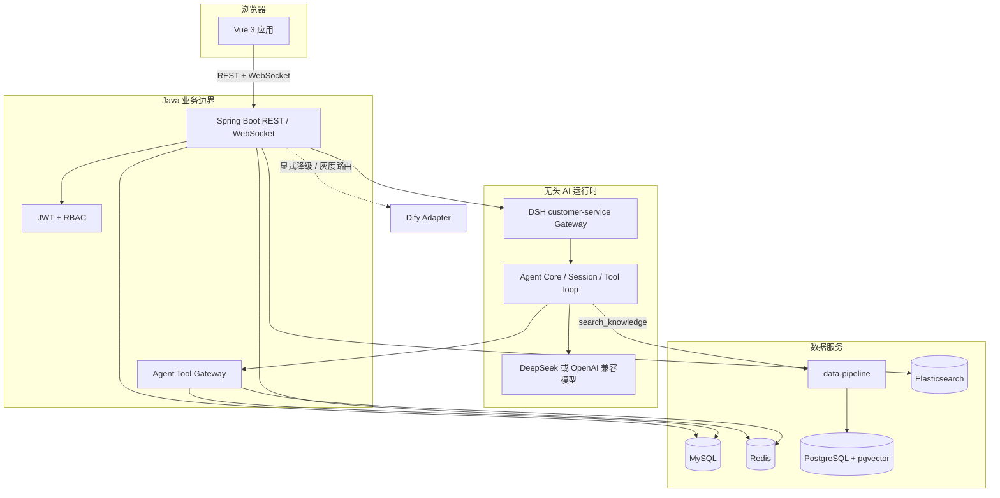
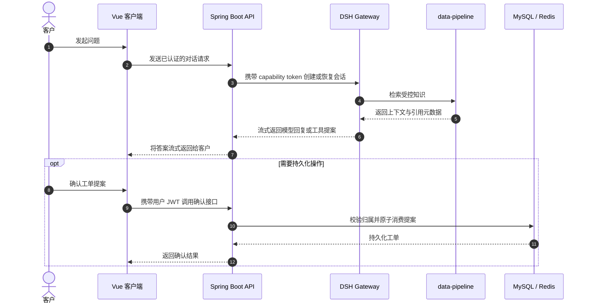

# AI 智能客服平台

<p align="center">
  <strong>面向客服对话、知识检索和人工协作的边界清晰、可审计智能客服平台。</strong>
  <br />
  <a href="README.md">English</a>
</p>

<p align="center">
  
  
  
  
  
</p>

> 平台将业务事实保留在 Java 服务中，只向 Agent 提供受控上下文和工具；创建工单等持久化写入必须经过已认证用户确认。

## 一览

| 产品面 | 能力 | 主要运行时 |
| --- | --- | --- |
| 客户对话 | RAG 问答、流式响应、订单查询和人工转接 | Vue 3 + Spring Boot |
| 客服工作台 | 工单队列、认领、回复、SLA 状态和实时更新 | Vue 3 + WebSocket/SSE |
| 知识中心 | 文档上传、解析、分块、向量化、审核、发布、归档和角色过滤 | data-pipeline + pgvector |
| AI 编排 | 会话生命周期、Prompt 预算、工具调用、重试和恢复边界 | DeepSeek Harness |
| 治理能力 | JWT 鉴权、RBAC、capability token、审计事件和指标 | Spring Security + Micrometer |

## 产品展示

<table>
  <tr>
    <td width="33%"><strong>💬 客户会话</strong><br />支持带引用的流式 AI 回复、上下文订单查询，以及受控的人工客服转接。</td>
    <td width="33%"><strong>🧑‍💻 客服工作台</strong><br />围绕队列、工单、SLA、实时消息和客户历史打造的运营视图。</td>
    <td width="33%"><strong>📚 知识治理</strong><br />提供文档版本、解析分块、审核发布、元数据过滤和按角色检索。</td>
  </tr>
  <tr>
    <td><strong>🧾 工单提案</strong><br />模型只能生成短期提案；最终写入必须由已认证用户主动确认。</td>
    <td><strong>🛡️ 权限边界</strong><br />Capability token 将工具绑定到真实用户和会话，模型不能选择或冒用身份。</td>
    <td><strong>📈 可观测运行时</strong><br />结构化日志和指标覆盖延迟、首 token、token 用量、检索数量、工具结果和鉴权失败。</td>
  </tr>
</table>

## 系统架构

以下图示使用 Mermaid 编写，GitHub 可以原生渲染，并可随代码一起评审和维护。



### 对话与写入流程



## 设计原则

- **业务事实由服务端持有。** Java 后端负责用户、订单、工单、会话和鉴权决策。
- **Agent 依赖协议。** Agent Core 使用 `KnowledgeRetriever`、`ChatModel` 和工具契约，不直接导入数据库或模型厂商实现。
- **知识在进入模型前完成过滤。** `data-pipeline` 应用 metadata、过期时间、父子文档和角色 ACL 约束。
- **写入采用两阶段流程。** `create_work_order` 只生成短期 Redis proposal，登录用户确认后才执行持久化写入。
- **身份不由模型控制。** Java 层生成短期用户/会话 capability token，通过 `X-Agent-Capability-Token` 传递，绝不写入模型上下文。
- **模型供应商选择显式化。** 默认使用 `dsh`，`dify` 用作显式降级，`gray` 支持稳定的按会话路由。

## 仓库结构

```text
Backend/                  Spring Boot 多模块业务后端
  backend-domain/         领域模型、仓储和业务端口
  backend-application/    用例编排、会话和异步工作流
  backend-infrastructure/ MySQL/Redis/RabbitMQ/ES/Dify/DSH 适配器
  backend-interfaces/     REST、WebSocket、安全和工具网关
  backend-boot/            运行配置和应用入口
  sql/                     MySQL 初始化和迁移
Frontend/                 Vue 3 + Vite 客户端
data-pipeline/            解析、分块、Embedding 和 pgvector HTTP 服务
deepseek-harness/         DSH 源码工作区及客服组合
history/                  不参与当前工作流的历史归档
ENGINEERING_AUDIT.md      工程审计、加固说明和验证记录
README.md                 英文项目说明
README-CN.md              中文项目说明
```

## 环境要求

| 组件 | 基线版本 |
| --- | --- |
| JDK | 21+ |
| Maven | 3.9+ |
| Node.js | data-pipeline 使用 22+；DSH 使用 22.19+ 或 24+ |
| Docker Compose | PostgreSQL、Redis、RabbitMQ、Elasticsearch 和 LibreOffice |
| PostgreSQL | 16，并启用 pgvector 扩展 |
| MySQL | 8.0+ |
| pnpm | DSH 工作区使用 11.7.0 |

## 快速启动

建议按以下顺序启动服务，使每个边界都能发现下游依赖。

### 1. 启动基础设施

在仓库根目录执行：

```bash
docker compose -f Backend/docker-compose.yml up -d
```

该命令启动 `vector-postgres`、Redis、RabbitMQ、Elasticsearch 和 LibreOffice。向量数据库使用 `pgvector/pgvector:pg16`，初始化脚本为 [`data-pipeline/sql/migrations/V1__knowledge_chunks.sql`](data-pipeline/sql/migrations/V1__knowledge_chunks.sql)。

### 2. 启动数据管道

```bash
cd data-pipeline
npm install
# 将 .env.example 复制为 .env，并设置 VECTOR_DATABASE_URL、
# EMBEDDING_API_KEY 和 PIPELINE_SERVICE_TOKEN。
npm run dev
```

服务监听 `http://localhost:3002`。`/health` 和 `/ready` 用于探活，其余接口需要 `Authorization: Bearer <PIPELINE_SERVICE_TOKEN>`。

如需一次性导入旧向量导出文件：

```bash
npm run migrate:chroma -- C:/path/to/export.json customer-service
```

该迁移只读取导出文件并写入 pgvector，不会将旧向量库加入运行时依赖。

### 3. 启动 DSH 客服组合

```bash
cd deepseek-harness
pnpm install
pnpm build:lib:host
```

设置以下运行时变量：

```text
DEEPSEEK_API_KEY              模型供应商凭据
DSH_GATEWAY_SERVICE_TOKEN     Java 后端与 DSH 共享的服务令牌
PIPELINE_SERVICE_TOKEN        DSH 调用 data-pipeline 使用的令牌
BACKEND_BASE_URL              http://localhost:8081
DATA_PIPELINE_URL             http://localhost:3002
```

然后启动显式 ACP 组合：

```bash
node --import tsx packages/examples/acp-demo/src/bin.ts \
  --config examples/customer-service/cordis.yml
```

Gateway 监听 `127.0.0.1:3001`。客服示例是直接 ACP 组合，并不是已安装的 `dsh` profile。

### 4. 构建并启动后端

先使用 [`Backend/sql/init.sql`](Backend/sql/init.sql) 初始化 MySQL，再设置：

```text
JWT_SECRET                         至少 32 个 UTF-8 字节，不提供不安全默认值
DB_URL / DB_USERNAME / DB_PASSWORD MySQL 连接配置
DSH_GATEWAY_SERVICE_TOKEN          必须与 DSH Gateway 一致
DSH_GATEWAY_BASE_URL               默认 http://localhost:3001
AGENT_PROVIDER                     dsh（默认）、dify 或 gray
```

构建并运行：

```bash
cd Backend
mvn -o -pl backend-boot -am package
java -jar backend-boot/target/backend-boot-0.0.1-SNAPSHOT.jar
```

后端监听 `http://localhost:8081`，启动时由 Flyway 应用内置迁移。

### 5. 启动前端

```bash
cd Frontend
npm install
npm run dev
```

打开 `http://localhost:5173`。Vite 会把 `/api` 和 `/ws` 代理到 `8081` 端口的后端。

## 服务地图

| 服务 | 默认地址 | 探活 / 用途 |
| --- | --- | --- |
| 前端 | `http://localhost:5173` | Vue 开发服务器 |
| 后端 | `http://localhost:8081` | REST、WebSocket、`/actuator/health` |
| DSH Gateway | `http://localhost:3001` | 无头客服 AI 边界 |
| 数据管道 | `http://localhost:3002` | `/health`、`/ready` 和受保护的 RAG API |
| MySQL | `localhost:3306` | 业务事实和鉴权数据 |
| PostgreSQL | `localhost:5432` | pgvector 知识分块 |
| Redis | `localhost:6379` | 缓存、会话、提案和锁 |
| RabbitMQ | `localhost:5672` | 领域事件和异步工作流 |
| Elasticsearch | `http://localhost:9200` | 运营和知识搜索支持 |

## 安全边界

面向 Agent 的工具保持最小化：

| 工具能力 | 行为 |
| --- | --- |
| `order:read:self` | 只能读取当前用户自己的订单 |
| `knowledge:read` | 通过 data-pipeline 检索服务端过滤后的知识 |
| `work_order:propose:self` | 创建短期 Redis 提案，不直接提交工单 |

确认接口为 `POST /api/agent/tools/work-orders/proposals/{proposalId}/confirm`。Java 会再次校验提案归属，并通过原子 `getAndDelete` 防止同一个提案被重复消费。

## 健康检查与验证

快速探活：

```bash
curl http://localhost:3002/health
curl http://localhost:3002/ready
curl http://localhost:8081/actuator/health
```

建议执行以下本地检查：

```bash
# data-pipeline
cd data-pipeline
npm run typecheck
npm test -- --run
npm run build

# DSH host aggregate
cd deepseek-harness
pnpm typecheck
pnpm build:lib:host

# Java modules
cd Backend
mvn -o -pl backend-interfaces -am test

# Vue unit test
cd Frontend
npm run test:unit
```

## 文档导航

- [English guide](README.md)
- [工程审计与验证记录](ENGINEERING_AUDIT.md)
- [后端数据库初始化](Backend/sql/init.sql)
- [客服 DSH 配置](deepseek-harness/examples/customer-service/cordis.yml)
- [客服组合说明](deepseek-harness/examples/customer-service/README.md)
- [向量表结构迁移](data-pipeline/sql/migrations/V1__knowledge_chunks.sql)

## 贡献约定

1. 不要把凭据和本地 `.env` 文件提交到仓库。
2. 新增 Agent 工具时，保持 Java 业务边界不被绕过。
3. 在能真实覆盖问题的最小测试接缝处补充或更新测试。
4. 创建 Pull Request 前执行相关验证命令。

详细的完成度评分、P0-P3 问题、文件级变更、Prompt 对比、测试历史和剩余技术债务见 [`ENGINEERING_AUDIT.md`](ENGINEERING_AUDIT.md)。
