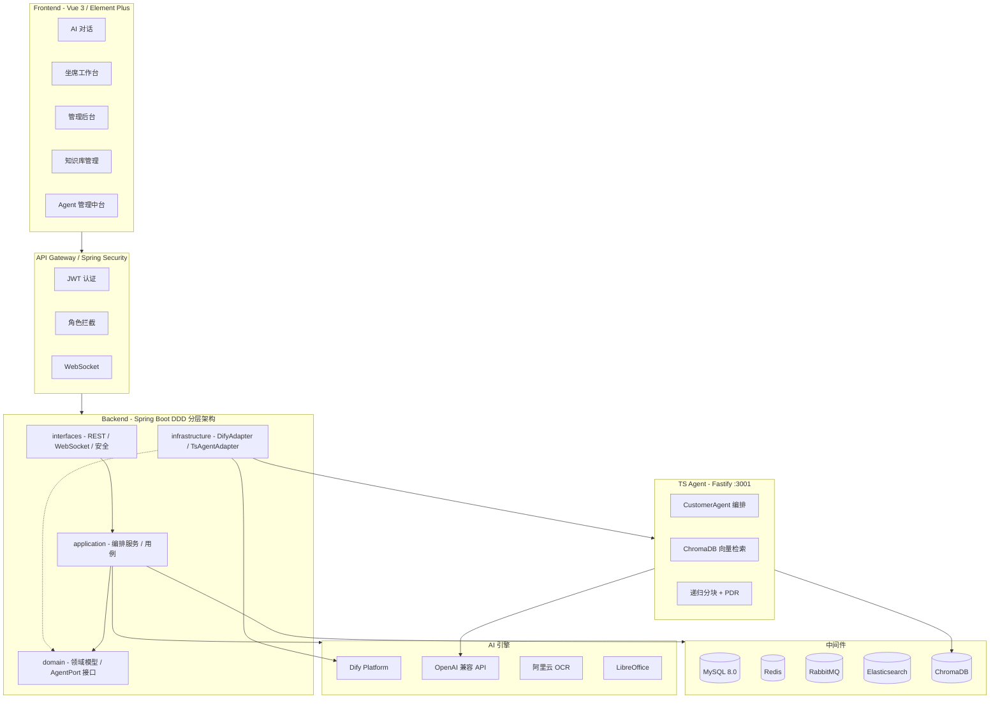
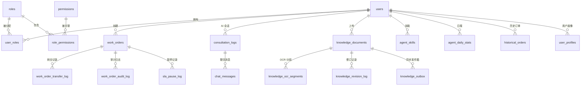

<p align="center">
  
  
  
  
  
  
  
  
  
  
  
</p>

<h1 align="center">🤖 AI 智能客服系统</h1>
<h3 align="center">AI Customer Service Platform</h3>

<p align="center">
  基于 <strong>Dify + 自研 TS Agent + Spring Boot + Vue 3</strong> 构建的全栈智能客服平台，<br>
  Dify 与自研 Agent 可一键切换，适用于电商、金融、政务、教育等各类线上业务场景。
</p>

<p align="center">
  <a href="#-核心特性">✨ 核心特性</a> &nbsp;|&nbsp;
  <a href="#-技术架构">🏗️ 技术架构</a> &nbsp;|&nbsp;
  <a href="#-agent-架构与切换">🔄 Agent 架构</a> &nbsp;|&nbsp;
  <a href="#-快速开始">🚀 快速开始</a> &nbsp;|&nbsp;
  <a href="#-项目结构">📁 项目结构</a> &nbsp;|&nbsp;
  <a href="#-功能模块">🧩 功能模块</a> &nbsp;|&nbsp;
  <a href="#-api-概览">📡 API 概览</a>
</p>

---

## ✨ 核心特性

<table>
  <tr>
    <td width="50%">
      <h3>💬 AI 智能会话</h3>
      <ul>
        <li>双引擎切换：<strong>Dify 平台</strong> 与 <strong>自研 TS Agent</strong>（Function Calling + RAG）一键切换</li>
        <li>支持流式对话（WebSocket / SSE）与阻塞式调用双模式</li>
        <li>公有频道与私密频道双模式，未登录也可体验 AI 客服</li>
        <li>会话超时自动归档，Redis 管理 Session TTL</li>
        <li>用户满意度评分（1-5 星）</li>
      </ul>
    </td>
    <td width="50%">
      <h3>📋 工单全生命周期</h3>
      <ul>
        <li>AI 智能分析：自动打标、业务分类、情感识别、分派置信度</li>
        <li><strong>Smart Dispatch Engine</strong>：技能匹配 + 负载均衡 + 在线优先派单</li>
        <li>工单流转日志 & 操作审计全链路记录</li>
        <li>支持转交、挂起、完结、评价</li>
      </ul>
    </td>
  </tr>
  <tr>
    <td width="50%">
      <h3>📚 知识库管理</h3>
      <ul>
        <li>支持 PDF / Word / Excel / 纯文本 多格式上传</li>
        <li>阿里云 OCR 智能识别 + OpenCV 图像预处理</li>
        <li>分段审核：边界框可视化、置信度评分、人工校正</li>
        <li>双通道同步：Dify 知识库 / <strong>ChromaDB 向量库</strong>（递归分块 + 父文档检索）</li>
        <li>MySQL ngram + Elasticsearch + 向量语义检索 三引擎</li>
        <li>文档版本管理、到期自动归档、阅读状态追踪</li>
      </ul>
    </td>
    <td width="50%">
      <h3>⏱️ SLA 时效管理</h3>
      <ul>
        <li>按业务线 + 优先级配置响应/解决时限</li>
        <li>工作日历：工作时段、节假日、特殊日期</li>
        <li>有效时间精准计算（扣除暂停 & 非工作时段）</li>
        <li>超时预警 & 自动升级提醒（ShedLock 分布式定时任务）</li>
        <li>SLA 暂停/恢复（客户等待、第三方依赖、手动挂起）</li>
      </ul>
    </td>
  </tr>
  <tr>
    <td width="50%">
      <h3>🔐 细粒度权限 (RBAC)</h3>
      <ul>
        <li>5 种角色：<code>USER</code> | <code>VIP</code> | <code>AGENT</code> | <code>KB_ADMIN</code> | <code>ADMIN</code></li>
        <li><code>{resource}:{action}</code> 权限模型，前后端双拦截</li>
        <li>JWT 无状态认证 + Spring Security</li>
      </ul>
    </td>
    <td width="50%">
      <h3>📊 数据分析大盘</h3>
      <ul>
        <li>坐席日报：会话量、平均响应时长、满意度、SLA 合规率</li>
        <li>管理后台：全局服务数据、趋势分析</li>
        <li>知识库运营：检索热度、文档覆盖度</li>
        <li><strong>Agent 管理中台</strong>：多 Agent 指标可视化、健康监控</li>
        <li>ECharts 可视化图表</li>
      </ul>
    </td>
  </tr>
</table>

---

## 🔄 Agent 架构与切换

本系统支持两种 AI 引擎，通过一个环境变量一键切换：

| 属性 | Dify 模式（默认） | TS Agent 模式 |
|------|------------------|---------------|
| 激活配置 | `AGENT_PROVIDER=dify` | `AGENT_PROVIDER=ts-agent` |
| LLM | Dify 平台托管 | OpenAI 兼容接口（可选 mock 模式） |
| 向量数据库 | Dify 内置 | **ChromaDB**（自建） |
| 分块策略 | Dify 自动（不可控） | **递归分块 + 父文档检索（PDR）** |
| Embedding | Dify 内置 | OpenAI 兼容 `/embeddings` API |
| 后端适配器 | `DifyAdapter` | `TsAgentAdapter` |
| 知识库同步 | Outbox → RabbitMQ → Dify | HTTP multipart → TS Agent → ChromaDB |

### 切换方法

```bash
# 使用 Dify（默认，无需配置）
export AGENT_PROVIDER=dify

# 切换为自研 TS Agent
export AGENT_PROVIDER=ts-agent
export TS_AGENT_BASE_URL=http://localhost:3001
```

### 自研 TS Agent 架构

```
ts-enterprise-webagent/          # TypeScript Monorepo
├── packages/shared/             # Zod Schema 共享契约
├── packages/core/               # Agent 核心编排
│   ├── agents/IAgent.ts         #   统一 Agent 接口（Dify / 自定义）
│   ├── agents/AgentRegistry.ts  #   Agent 注册中心
│   ├── routing/                 #   意图路由（RAG 快速 / FC 慢速 / 兜底）
│   ├── services/                #   情绪分析 · 对话摘要
│   └── config/agentConfig.ts    #   统一敏感配置管理
├── apps/server/                 # Fastify HTTP 服务
│   ├── adapters/
│   │   ├── chromadbKnowledgeBase.ts  # ChromaDB 向量检索
│   │   └── difyAgentAdapter.ts       # Dify 适配器
│   ├── services/
│   │   ├── documentChunkingService.ts    # 递归分块 + PDR
│   │   └── chromadbKnowledgeBaseManager.ts  # 知识库管理
│   └── routes/backendCompatibleRoutes.ts  # Backend 对齐 API
├── apps/widget/                 # Web Component 嵌入挂件
├── docs/
│   ├── architecture-research.md         # Agent 架构选型调研
│   └── chunking-strategy-research.md    # 分块策略调研
└── agent-management-ui/         # Agent 管理中台（独立）
```

### 知识库检索链路

```
文档上传 → Backend TsAgentAdapter
         → HTTP POST → TS Agent Server
         → DocumentChunkingService（递归分块 + PDR）
         → Embedding API（批量向量化）
         → ChromaDB（cosine HNSW 索引）

用户提问 → CustomCustomerAgent
         → ChromadbKnowledgeBase.search()
         → Embedding API（查询向量化）
         → ChromaDB Top-K 检索
         → LLM 生成回答
```

相关技术文档：
- [Agent 架构选型调研](ts-enterprise-webagent/docs/architecture-research.md)
- [分块策略调研报告](ts-enterprise-webagent/docs/chunking-strategy-research.md)

---

## 🏗️ 技术架构

### 整体架构图



---

## 🚀 快速开始

### 环境要求

| 依赖 | 版本要求 |
|------|---------|
| JDK | 21+ |
| Maven | 3.9+ |
| Node.js | 18+ |
| Docker & Docker Compose | 最新稳定版 |
| MySQL | 8.0+ |
| ChromaDB | 0.5+（TS Agent 模式，可选） |

### 1️⃣ 克隆仓库

```bash
git clone <your-repo-url>
cd ai_customer_service
```

### 2️⃣ 启动中间件服务

```bash
cd Backend
docker-compose up -d
```

> 一键启动 Redis、RabbitMQ、Elasticsearch、LibreOffice。TS Agent 模式还需启动 ChromaDB：
> ```bash
> docker run -d -p 8000:8000 chromadb/chroma
> ```

### 3️⃣ 初始化数据库

```bash
mysql -u root -p < Backend/sql/init.sql
```

### 4️⃣ 配置环境变量

**Backend** (`application.yml`)：

```yaml
# 数据库
spring:
  datasource:
    url: ${DB_URL:jdbc:mysql://localhost:3306/ai_customer_service}
    username: ${DB_USERNAME:root}
    password: ${DB_PASSWORD:your_password}

# AI 引擎选择（dify 或 ts-agent）
agent:
  provider: ${AGENT_PROVIDER:dify}

# Dify（默认）
dify:
  base-url: ${DIFY_BASE_URL:https://api.dify.ai}
  chat-key: ${DIFY_CHAT_KEY}
  knowledge-key: ${DIFY_KNOWLEDGE_KEY}

# TS Agent（切换到 ts-agent 时生效）
ts-agent:
  base-url: ${TS_AGENT_BASE_URL:http://localhost:3001}
```

**TS Agent** (复制 `.env.example` 为 `.env`)：

```bash
# ts-enterprise-webagent/apps/server/.env
AGENT_MODEL_MODE=openai-compatible
OPENAI_API_KEY=sk-xxx
OPENAI_MODEL=gpt-4.1-mini

# Embedding + ChromaDB
EMBEDDING_MODEL=text-embedding-ada-002
EMBEDDING_DIMENSIONS=1536
CHROMADB_URL=http://localhost:8000
CHROMADB_COLLECTION=customer_service_knowledge
```

### 5️⃣ 启动后端

```bash
cd Backend
./mvnw clean package -DskipTests
cd backend-boot
./mvnw spring-boot:run
# → http://localhost:8081
```

### 6️⃣ 启动 TS Agent（可选）

```bash
cd ts-enterprise-webagent
npm install
npm run dev:server
# → http://localhost:3001
```

### 7️⃣ 启动前端

```bash
cd Frontend
npm install
npm run dev
# → http://localhost:5173
```

### 8️⃣ 启动 Agent 管理中台（可选）

```bash
cd agent-management-ui
# 浏览器直接打开 index.html，或使用任意静态文件服务器
npx serve .
# → http://localhost:3000
```

### 9️⃣ 访问应用

| 地址 | 说明 |
|------|------|
| `http://localhost:5173/chat` | 🤖 AI 智能客服（面向客户） |
| `http://localhost:5173/login` | 🔐 登录页 |
| `http://localhost:5173/agent` | 👩‍💼 坐席工作台 |
| `http://localhost:5173/admin` | ⚙️ 系统管理后台 |
| `http://localhost:3001/health` | 🔧 TS Agent 健康检查 |
| `http://localhost:3000` | 📊 Agent 管理中台 |

---

## 📁 项目结构

```
ai_customer_service/
├── Backend/                                # ☕ 后端 (Spring Boot 多模块)
│   ├── backend-common/                     # 公共模块：工具类 · 枚举 · 异常 · 配置属性
│   ├── backend-domain/                     # 领域模块：实体 · 值对象 · 仓储接口 · AgentPort
│   ├── backend-application/                # 应用模块：用例编排 · 事务服务
│   ├── backend-infrastructure/             # 基础设施
│   │   ├── dify/                           #   DifyAdapter · DifyClient
│   │   └── tsagent/                        #   TsAgentAdapter · TsAgentClient（新增）
│   ├── backend-interfaces/                 # 接口模块：REST · WebSocket · Security
│   ├── backend-boot/                       # 启动模块 · application.yml
│   ├── sql/                                # DDL 脚本
│   ├── docker-compose.yml
│   └── pom.xml
│
├── Frontend/                               # 🖥️ 前端 (Vue 3 + Vite)
│   └── src/domains/                        # 10 个业务域（同前）
│
├── ts-enterprise-webagent/                 # 🔧 自研 TS Agent (Monorepo)
│   ├── packages/
│   │   ├── shared/                         #   Zod 共享契约
│   │   └── core/                           #   Agent 核心编排
│   │       └── src/
│   │           ├── agents/                 #     IAgent · AgentRegistry · CustomCustomerAgent
│   │           ├── routing/                #     意图分类 · 路由调度
│   │           ├── services/               #     情绪分析 · 对话摘要
│   │           └── config/                 #     统一敏感配置管理
│   ├── apps/
│   │   ├── server/                         #   Fastify HTTP 服务
│   │   │   └── src/
│   │   │       ├── adapters/               #     ChromaDB · Dify · InMemory
│   │   │       ├── services/               #     文档分块 · 知识库管理
│   │   │       └── routes/                 #     API 路由
│   │   └── widget/                        #   Web Component 挂件
│   ├── docs/
│   │   ├── architecture-research.md        #   Agent 架构选型调研
│   │   └── chunking-strategy-research.md   #   分块策略调研
│   └── package.json
│
├── agent-management-ui/                    # 📊 Agent 管理中台
│   ├── index.html                          #   Vue 3 + Element Plus + ECharts
│   ├── app.js                              #   仪表盘 · Agent 管理 · 会话监控
│   └── style.css
│
├── 知识文件monk数据/
└── README.md
```

---

## 🧩 功能模块

### 🤖 AI 智能对话

| 功能 | 说明 |
|------|------|
| 双引擎切换 | Dify 平台 / 自研 TS Agent，`AGENT_PROVIDER` 一键切换 |
| 流式对话 | WebSocket (Backend) + SSE (TS Agent) 流式响应 |
| 意图路由 | RAG 快速通道（FAQ） / Function Calling 通道（工单/转人工）|
| 工单意图检测 | 关键词 + 规则混合分类，自动识别工单/售后/转人工诉求 |
| 情绪分析 | 关键词 + 情感词典，四级情绪（positive/neutral/negative/angry）|
| 公有频道 | 未登录用户可访问 `/chat` 进行 AI 对话 |
| 会话管理 | Redis TTL 自动超时归档 |
| 会话记录 | 完整对话历史写入 `consultation_logs` + `chat_messages` |

### 📋 工单管理

```
待处理 ──→ 处理中 ──→ 已完成
                └──→ 已取消
```

| 功能 | 说明 |
|------|------|
| AI 自动分析 | 自动打标签、分类（售前/售后）、情感识别、分派置信度 |
| 对话摘要 | 转人工时自动生成会话摘要与优先级评估 |
| 智能派单 | 按技能标签 + 当前负载 + 在线状态分配坐席 |
| 工单转交 | 支持坐席间转交，完整转交日志 |
| 操作审计 | SUBMIT → AI_ANALYSIS → DISPATCH → STATUS_CHANGE → COMPLETE |

### 📚 知识库

```
上传文档 → OCR 识别 → 分段审核 → 发布 → 同步 Dify / ChromaDB + ES
```

| 功能 | 说明 |
|------|------|
| 多格式支持 | PDF / DOCX / XLSX / TXT |
| OCR 识别 | 阿里云 OCR + OpenCV 图像预处理 |
| 分段审核 | 边界框可视化、置信度展示、人工修正 |
| 双通道同步 | Dify 知识库（Outbox + RabbitMQ）/ ChromaDB 向量库（HTTP multipart）|
| 向量语义检索 | ChromaDB cosine HNSW 索引（TS Agent 模式）|
| 分块策略 | 递归分块(chunk=800/overlap=150) + 父文档检索(PDR, child=400/parent=2000) |
| 全文检索 | Elasticsearch + MySQL ngram 双引擎 |
| 版本管理 | 文档历史版本，修订日志 |
| 到期归档 | 自动归档过期文档 |

### 📊 Agent 管理中台

| 模块 | 功能 |
|------|------|
| 总览仪表盘 | Agent 数量、请求趋势图、响应时间排行、Agent 分布饼图 |
| Agent 管理 | 列表/详情/健康检查/指标采集/接入自定义 Agent |
| 会话监控 | 活跃会话列表、AI 阻断状态、会话清除 |
| 系统配置 | 脱敏展示 LLM/Embedding/ChromaDB/Dify 配置状态 |

---

## 🗄️ 数据库模型

> 共 30+ 张数据表，以下为核心表关系：



---

## ✨ API 概览

| 路径前缀 | 认证 | 描述 |
|---------|------|------|
| `GET /api/health` | Public | Backend 健康检查 |
| `GET /health` | Public | TS Agent 健康检查 |
| `POST /api/auth/login` | Public | 用户登录 |
| `POST /api/auth/register` | Public | 用户注册 |
| `GET /api/public/chat/**` | Public | 公开 AI 对话 |
| `WS /ws/chat` | Public | WebSocket 流式对话 |
| `POST /api/v1/customer-agent/messages` | Public | TS Agent 对话 |
| `POST /api/v1/chat-messages` | Public | TS Agent 阻塞式对话（Backend 对齐） |
| `POST /api/v1/chat-messages/streaming` | Public | TS Agent SSE 流式 |
| `POST /api/v1/knowledge/datasets/:id/documents` | — | TS Agent 文档上传（Backend 对齐） |
| `GET /api/v1/management/agents` | Public | Agent 管理 API |
| `GET /api/admin/**` | ADMIN | 系统管理 |
| `GET /api/knowledge/**` | Authenticated | 知识库管理 |

---

## 🐳 Docker 中间件

| 服务 | 端口 | 管理界面 | 说明 |
|------|------|---------|------|
| **Redis** | 6379 | — | Session · 分布式锁 |
| **RabbitMQ** | 5672 | `http://localhost:15672` | 异步解耦 |
| **Elasticsearch** | 9200 | `http://localhost:9200` | 全文检索 |
| **LibreOffice** | — | — | 文档预览 |
| **ChromaDB** | 8000 | — | 向量语义检索（TS Agent 模式） |

```bash
# 启动所有中间件
cd Backend
docker-compose up -d

# 额外启动 ChromaDB（TS Agent 模式需要）
docker run -d -p 8000:8000 chromadb/chroma

# 停止
docker-compose down
```

---

## 🛠️ 技术栈速览

<table>
  <tr>
    <th>层级</th>
    <th>技术选型</th>
    <th>说明</th>
  </tr>
  <tr>
    <td>后端语言</td>
    <td></td>
    <td>虚拟线程 + 模式匹配 + 密封类</td>
  </tr>
  <tr>
    <td>后端框架</td>
    <td></td>
    <td>DDD 六模块分层架构</td>
  </tr>
  <tr>
    <td>ORM</td>
    <td></td>
    <td>XML Mapper + 动态 SQL</td>
  </tr>
  <tr>
    <td>安全</td>
    <td>Spring Security + JWT</td>
    <td>无状态认证 + RBAC</td>
  </tr>
  <tr>
    <td>前端框架</td>
    <td></td>
    <td>Composition API + Pinia</td>
  </tr>
  <tr>
    <td>UI 库</td>
    <td></td>
    <td>企业级组件库</td>
  </tr>
  <tr>
    <td>Agent 框架</td>
    <td></td>
    <td>自研 Agent · Fastify · Zod · Monorepo</td>
  </tr>
  <tr>
    <td>向量数据库</td>
    <td></td>
    <td>cosine HNSW · 批量 Embedding</td>
  </tr>
  <tr>
    <td>构建工具</td>
    <td></td>
    <td>极速 HMR</td>
  </tr>
  <tr>
    <td>图表</td>
    <td></td>
    <td>数据可视化</td>
  </tr>
  <tr>
    <td>AI 引擎</td>
    <td>Dify / 自研 TS Agent</td>
    <td>一键切换，双引擎并存</td>
  </tr>
  <tr>
    <td>搜索引擎</td>
    <td> + ChromaDB</td>
    <td>全文检索 + 向量语义检索</td>
  </tr>
  <tr>
    <td>消息队列</td>
    <td></td>
    <td>异步解耦</td>
  </tr>
  <tr>
    <td>缓存</td>
    <td></td>
    <td>Session · 分布式锁</td>
  </tr>
  <tr>
    <td>OCR</td>
    <td>阿里云 OCR + OpenCV</td>
    <td>文档识别 + 图像预处理</td>
  </tr>
  <tr>
    <td>文档处理</td>
    <td>PDFBox · POI · LibreOffice</td>
    <td>文档解析与预览</td>
  </tr>
</table>

---

## 📝 License

本项目仅供学习与参考使用。

---

<p align="center">
  <sub>Made with ❤️ by the development team</sub>
</p>
