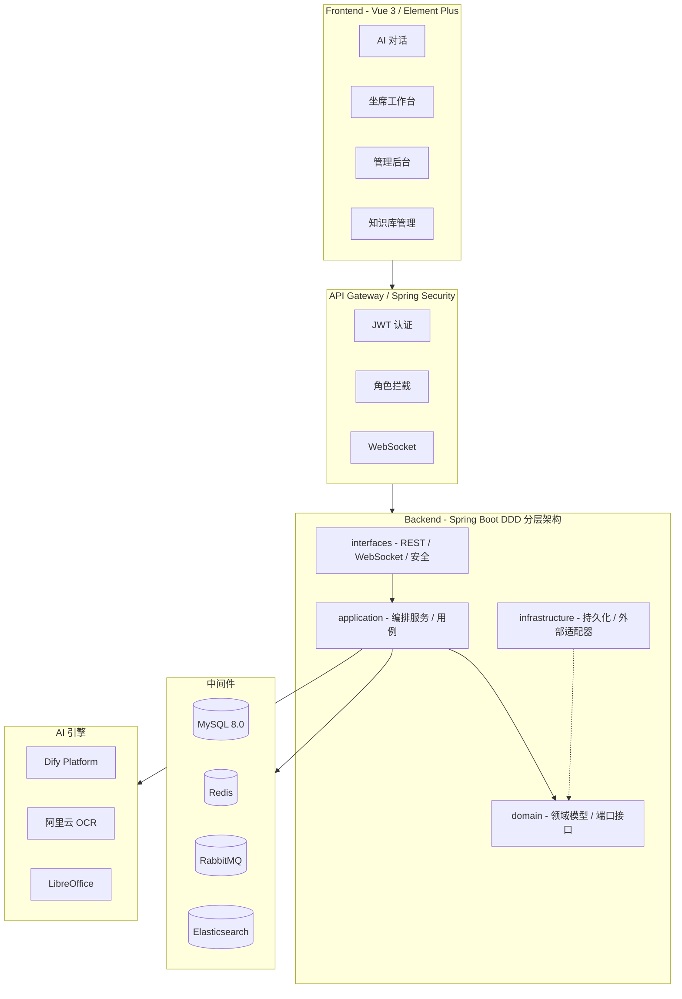
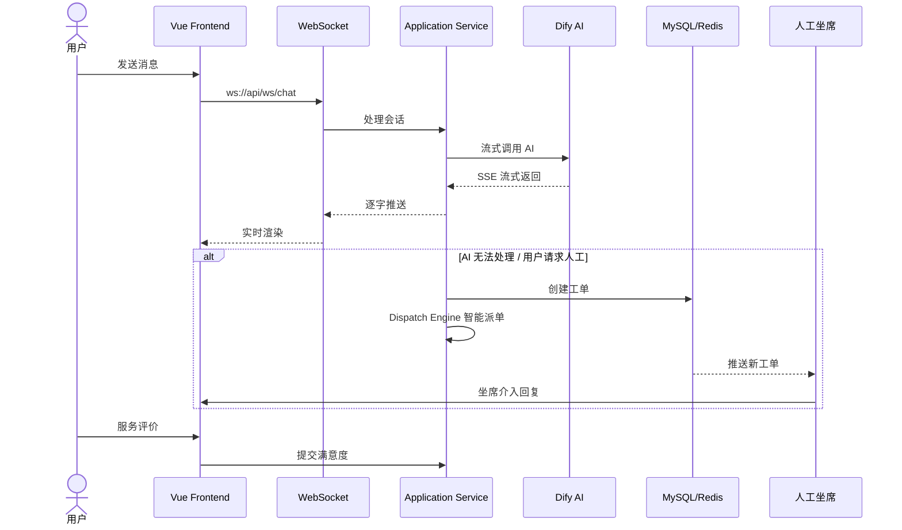
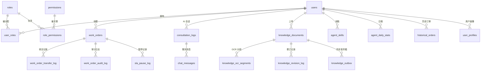

<p align="center">
  
  
  
  
  
  
  
  
  
</p>

<h1 align="center">🤖 AI 智能客服系统</h1>
<h3 align="center">AI Customer Service Platform</h3>

<p align="center">
  基于 <strong>Dify + Spring Boot + Vue 3</strong> 构建的全栈智能客服平台，<br>
  适用于电商、金融、政务、教育等各类线上业务场景，提供 AI 自动应答、工单流转、知识库管理与 SLA 监控一体化解决方案。
</p>

<p align="center">
  <a href="#-核心特性">✨ 核心特性</a> &nbsp;|&nbsp;
  <a href="#-技术架构">🏗️ 技术架构</a> &nbsp;|&nbsp;
  <a href="#-快速开始">🚀 快速开始</a> &nbsp;|&nbsp;
  <a href="#-项目结构">📁 项目结构</a> &nbsp;|&nbsp;
  <a href="#-功能模块">🧩 功能模块</a> &nbsp;|&nbsp;
  <a href="#-API-概览">📡 API 概览</a>
</p>

---

## ✨ 核心特性

<table>
  <tr>
    <td width="50%">
      <h3>💬 AI 智能会话</h3>
      <ul>
        <li>基于 <strong>Dify</strong> 大模型应用平台，支持流式对话（WebSocket）</li>
        <li>公有频道与私密频道双模式，未登录也可体验 AI 客服</li>
        <li>会话超时自动归档，Redis 管理 Session TTL</li>
        <li>用户满意度评分（1-5 星）</li>
      </ul>
    </td>
    <td width="50%">
      <h3>📋 工单全生命周期</h3>
      <ul>
        <li>AI 智能分析：自动打标、业务分类、情感识别</li>
        <li><strong>Smart Dispatch Engine</strong>：技能匹配 + 负载均衡 + 在线优先派单</li>
        <li>工单流转日志 & 操作审计全链路记录</li>
        <li>支持转交、挂起、完结、评价</li>
      </ul>
    </td>
  </tr>
  <tr>
    <td width="50%">
      <h3>📚 知识库管理</h3>
      <ul>
        <li>支持 PDF / Word / Excel / 纯文本 多格式上传</li>
        <li>阿里云 OCR 智能识别 + OpenCV 图像预处理</li>
        <li>分段审核：边界框可视化、置信度评分、人工校正</li>
        <li>Dify 知识库自动同步（Outbox Pattern + RabbitMQ 重试）</li>
        <li>MySQL ngram + Elasticsearch 双引擎全文检索</li>
        <li>文档版本管理、到期自动归档、阅读状态追踪</li>
      </ul>
    </td>
    <td width="50%">
      <h3>⏱️ SLA 时效管理</h3>
      <ul>
        <li>按业务线 + 优先级配置响应/解决时限</li>
        <li>工作日历：工作时段、节假日、特殊日期</li>
        <li>有效时间精准计算（扣除暂停 & 非工作时段）</li>
        <li>超时预警 & 自动升级提醒（ShedLock 分布式定时任务）</li>
        <li>SLA 暂停/恢复（客户等待、第三方依赖、手动挂起）</li>
      </ul>
    </td>
  </tr>
  <tr>
    <td width="50%">
      <h3>🔐 细粒度权限 (RBAC)</h3>
      <ul>
        <li>5 种角色：<code>USER</code> | <code>VIP</code> | <code>AGENT</code> | <code>KB_ADMIN</code> | <code>ADMIN</code></li>
        <li><code>{resource}:{action}</code> 权限模型，前后端双拦截</li>
        <li>JWT 无状态认证 + Spring Security</li>
      </ul>
    </td>
    <td width="50%">
      <h3>📊 数据分析大盘</h3>
      <ul>
        <li>坐席日报：会话量、平均响应时长、满意度、SLA 合规率</li>
        <li>管理后台：全局服务数据、趋势分析</li>
        <li>知识库运营：检索热度、文档覆盖度</li>
        <li>ECharts 可视化图表</li>
      </ul>
    </td>
  </tr>
</table>

---

## 🏗️ 技术架构

### 整体架构图



### DDD 分层依赖关系

```
backend-boot (启动器)
    └── backend-interfaces (接口层) ─── Spring MVC · WebSocket · Security
            └── backend-application (应用层) ─── 用例编排 · 事务管理
                    ├── backend-domain (领域层) ─── 实体 · 值对象 · 端口
                    └── backend-infrastructure (基础设施层) ─── MyBatis · Dify · ES
```

> **核心原则：** 领域层不依赖任何外部框架，基础设施层通过端口接口实现依赖反转。

### 数据流向



---

## 🚀 快速开始

### 环境要求

| 依赖 | 版本要求 |
|------|---------|
| JDK | 21+ |
| Maven | 3.9+ |
| Node.js | 18+ |
| Docker & Docker Compose | 最新稳定版 |
| MySQL | 8.0+ |

### 1️⃣ 克隆仓库

```bash
git clone <your-repo-url>
cd ai_customer_service
```

### 2️⃣ 启动中间件服务

```bash
cd Backend
docker-compose up -d
```

> 一键启动 Redis、RabbitMQ、Elasticsearch、LibreOffice 四个容器。

### 3️⃣ 初始化数据库

```bash
mysql -u root -p < Backend/sql/init.sql
```

### 4️⃣ 配置环境变量

编辑 `Backend/backend-boot/src/main/resources/application.yml` 或设置环境变量：

```yaml
# 数据库
spring:
  datasource:
    url: ${DB_URL:jdbc:mysql://localhost:3306/ai_customer_service}
    username: ${DB_USERNAME:root}
    password: ${DB_PASSWORD:your_password}

# Dify AI 引擎
dify:
  base-url: ${DIFY_BASE_URL:https://api.dify.ai}
  knowledge-key: ${DIFY_KNOWLEDGE_KEY}
  chat-key: ${DIFY_CHAT_KEY}
  intervention-key: ${DIFY_INTERVENTION_KEY}
  workorder-key: ${DIFY_WORKORDER_KEY}

# 阿里云 OCR
ocr:
  aliyun:
    access-key-id: ${OCR_ALIYUN_ACCESS_KEY_ID}
    access-key-secret: ${OCR_ALIYUN_ACCESS_KEY_SECRET}
```

### 5️⃣ 启动后端

```bash
# Windows
cd Backend
mvnw.cmd clean package -DskipTests
cd backend-boot
mvnw.cmd spring-boot:run

# Linux / macOS
cd Backend
./mvnw clean package -DskipTests
cd backend-boot
./mvnw spring-boot:run
```

> 后端启动于 **`http://localhost:8081`**，健康检查：`GET /api/health`

### 6️⃣ 启动前端

```bash
cd Frontend
npm install
npm run dev
```

> 前端启动于 **`http://localhost:5173`**，已配置 API 代理到 `localhost:8081`

### 7️⃣ 访问应用

| 地址 | 说明 |
|------|------|
| `http://localhost:5173/chat` | 🤖 AI 智能客服（面向客户） |
| `http://localhost:5173/login` | 🔐 登录页 |
| `http://localhost:5173/agent` | 👩‍💼 坐席工作台 |
| `http://localhost:5173/admin` | ⚙️ 系统管理后台 |

---

## 📁 项目结构

```
ai_customer_service/
├── Backend/                                # ☕ 后端 (Spring Boot 多模块)
│   ├── backend-common/                     # 公共模块：工具类 · 枚举 · 异常 · 配置属性
│   ├── backend-domain/                     # 领域模块：实体 · 值对象 · 仓储接口 · 领域事件
│   ├── backend-application/                # 应用模块：用例编排 · 事务服务
│   ├── backend-infrastructure/             # 基础设施：MyBatis · Dify · OCR · ES · RabbitMQ
│   ├── backend-interfaces/                 # 接口模块：REST · WebSocket · Security · 切面
│   ├── backend-boot/                       # 启动模块：Spring Boot 入口 · application.yml
│   ├── sql/
│   │   ├── init.sql                        # 完整建表 DDL
│   │   └── migration_sla_effective.sql     # SLA 增量迁移脚本
│   ├── docker-compose.yml                  # 中间件容器编排
│   ├── pom.xml                             # 根 POM (聚合)
│   ├── mvnw / mvnw.cmd                     # Maven Wrapper
│   └── .mvn/                               # Maven 配置
│
├── Frontend/                               # 🖥️ 前端 (Vue 3 + Vite)
│   ├── src/
│   │   ├── core/                           # Axios · Pinia · Vue Router 初始化
│   │   ├── domains/                        # 领域模块 (10 个业务域)
│   │   │   ├── auth/                       #   登录 · 注册
│   │   │   ├── chat/                       #   AI 对话
│   │   │   ├── agent/                      #   坐席工作台
│   │   │   ├── agentmgmt/                  #   坐席/用户管理
│   │   │   ├── admin/                      #   SLA 配置 · 工作日历
│   │   │   ├── analytics/                  #   数据分析大盘
│   │   │   ├── knowledge/                  #   知识库审核与管理
│   │   │   ├── order/                      #   历史订单
│   │   │   ├── userprofile/                #   用户画像
│   │   │   └── workorder/                  #   工单管理
│   │   ├── layout/AdminLayout.vue          # 管理后台壳布局
│   │   ├── shared/                         # Composables · Pinia Stores
│   │   ├── styles/design-tokens.css        # 设计令牌 (CSS 自定义属性)
│   │   ├── App.vue
│   │   └── main.js
│   ├── index.html
│   ├── vite.config.js
│   └── package.json
│
├── 知识文件monk数据/                        # 📄 测试知识文档
└── README.md
```

---

## 🧩 功能模块

### 🤖 AI 智能对话

| 功能 | 说明 |
|------|------|
| 流式对话 | WebSocket + Dify SSE 流式响应，逐字输出 |
| 公有频道 | 未登录用户可访问 `/chat` 进行 AI 对话 |
| 会话管理 | Redis TTL 自动超时归档 |
| 满意度评价 | 每次坐席回复后 1-5 星评分 |
| 会话记录 | 完整对话历史写入 `consultation_logs` + `chat_messages` |

### 📋 工单管理

```
待处理 ──→ 处理中 ──→ 已完成
                └──→ 已取消
```

| 功能 | 说明 |
|------|------|
| AI 自动分析 | Dify Workflow 自动打标签、分类（售前/售后）、情感分析 |
| 智能派单 | 按技能标签 + 当前负载 + 在线状态分配坐席 |
| 工单转交 | 支持坐席间转交，完整转交日志 |
| 操作审计 | SUBMIT → AI_ANALYSIS → DISPATCH → STATUS_CHANGE → COMPLETE → CANCEL |
| 服务评价 | 工单完结后用户评分 |

### 📚 知识库

```
上传文档 → OCR 识别 → 分段审核 → 发布 → 同步 Dify + ES
```

| 功能 | 说明 |
|------|------|
| 多格式支持 | PDF / DOCX / XLSX / TXT |
| 分片上传 | 5MB 分片，支持断点续传 |
| OCR 识别 | 阿里云 OCR + OpenCV 图像预处理 |
| 分段审核 | 边界框可视化、置信度展示、人工修正 |
| 版本管理 | 文档历史版本，修订日志 |
| 全文检索 | Elasticsearch + MySQL ngram 双引擎 |
| Dify 同步 | Outbox Pattern + RabbitMQ 异步重试 |
| LibreOffice 预览 | Docker 容器转换文档为 PDF 预览 |
| 到期归档 | 自动归档过期文档 |
| 收藏 & 阅读状态 | 个人收藏夹、阅读进度追踪 |

### ⏱️ SLA 时效管理

| 功能 | 说明 |
|------|------|
| 规则配置 | 按 `biz_tag` + `priority` 配置响应/解决时限 |
| 工作日历 | 工作日期、工作时间段、法定假日、特殊日期 |
| 时间计算 | 扣除暂停和非工作时段的有效时间 |
| 超时告警 | ShedLock 分布式定时任务扫描 + 升级通知 |
| 暂停机制 | 客户等待中 / 三方依赖 / 手动挂起 |

### 🔐 权限管理

```
ADMIN ───── 系统管理员（全部权限）
  ├── KB_ADMIN ── 知识库管理员（上传·审核·发布·统计）
  ├── AGENT ───── 客服坐席（工单处理·在线介入·数据看板）
  ├── VIP ─────── VIP 用户
  └── USER ────── 普通用户（AI 对话·查看订单）
```

### 📊 数据分析

| 角色 | 看板内容 |
|------|---------|
| **ADMIN** | 全局数据：工单量、满意度、SLA 合规率、趋势分析 |
| **AGENT** | 个人日报：会话量、响应时长、满意度、SLA 数据 |
| **KB_ADMIN** | 知识库运营：文档覆盖度、检索热度、审核效率 |

---

## 🗄️ 数据库模型

> 共 30+ 张数据表，以下为核心表关系：



---

## 📡 API 概览

| 路径前缀 | 认证 | 描述 |
|---------|------|------|
| `GET /api/health` | Public | 健康检查 |
| `POST /api/auth/login` | Public | 用户登录 |
| `POST /api/auth/register` | Public | 用户注册 |
| `GET /api/public/chat/**` | Public | 公开 AI 对话 |
| `WS /ws/chat` | Public | WebSocket 流式对话 |
| `GET /api/chat/**` | Authenticated | 会话管理 |
| `GET /api/admin/**` | ADMIN | 系统管理 |
| `GET /api/analysis/**` | Authenticated | 数据分析 |
| `GET /api/orders/**` | Authenticated | 订单管理 |
| `GET /api/sla-config/**` | Authenticated | SLA 配置 |
| `GET /api/agent/**` | Authenticated | 坐席操作 |
| `GET /api/knowledge/**` | Authenticated | 知识库管理 |

---

## 🐳 Docker 中间件

项目根目录 `Backend/docker-compose.yml` 包含以下服务：

| 服务 | 端口 | 管理界面 |
|------|------|---------|
| **Redis** | 6379 | — |
| **RabbitMQ** | 5672 (AMQP) | `http://localhost:15672` |
| **Elasticsearch** | 9200 | `http://localhost:9200` |
| **LibreOffice** | — (CLI) | — |

```bash
# 启动所有中间件
cd Backend
docker-compose up -d

# 停止
docker-compose down
```

---

## 🛠️ 技术栈速览

<table>
  <tr>
    <th>层级</th>
    <th>技术选型</th>
    <th>说明</th>
  </tr>
  <tr>
    <td>后端语言</td>
    <td></td>
    <td>虚拟线程 + 模式匹配 + 密封类</td>
  </tr>
  <tr>
    <td>后端框架</td>
    <td></td>
    <td>DDD 六模块分层架构</td>
  </tr>
  <tr>
    <td>ORM</td>
    <td></td>
    <td>XML Mapper + 动态 SQL</td>
  </tr>
  <tr>
    <td>安全</td>
    <td>Spring Security + JWT</td>
    <td>无状态认证 + RBAC</td>
  </tr>
  <tr>
    <td>前端框架</td>
    <td></td>
    <td>Composition API + Pinia</td>
  </tr>
  <tr>
    <td>UI 库</td>
    <td></td>
    <td>企业级组件库</td>
  </tr>
  <tr>
    <td>构建工具</td>
    <td></td>
    <td>极速 HMR</td>
  </tr>
  <tr>
    <td>图表</td>
    <td></td>
    <td>数据可视化</td>
  </tr>
  <tr>
    <td>AI 引擎</td>
    <td></td>
    <td>LLM 应用编排</td>
  </tr>
  <tr>
    <td>搜索引擎</td>
    <td></td>
    <td>全文检索</td>
  </tr>
  <tr>
    <td>消息队列</td>
    <td></td>
    <td>异步解耦</td>
  </tr>
  <tr>
    <td>缓存</td>
    <td></td>
    <td>Session · 分布式锁</td>
  </tr>
  <tr>
    <td>OCR</td>
    <td>阿里云 OCR + OpenCV</td>
    <td>文档识别 + 图像预处理</td>
  </tr>
  <tr>
    <td>文档处理</td>
    <td>PDFBox · POI · LibreOffice</td>
    <td>文档解析与预览</td>
  </tr>
</table>

---

## 📝 License

本项目仅供学习与参考使用。

---

<p align="center">
  <sub>Made with ❤️ by the development team</sub>
</p>
