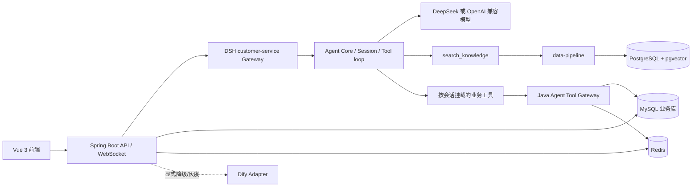

# AI 智能客服平台

这是一个由 Vue 3、Spring Boot、DeepSeek Harness（DSH）和 PostgreSQL + pgvector 组成的企业级智能客服系统。Java 后端保存用户、订单、工单和会话等业务事实；Agent 只通过窄接口读取业务数据、检索知识并提出业务操作建议。

## 当前架构



关键边界：

- Agent Core 只依赖 `KnowledgeRetriever`、`ChatModel` 等协议，不导入 PostgreSQL、pgvector 或具体模型 SDK。
- `data-pipeline` 负责解析、分块、Embedding、过滤、父子文档检索和向量存储；Agent 只接收受控的知识来源和引用元数据。
- DSH customer-service Gateway 在会话创建时挂载业务工具；工具凭据绑定到 Java 生成的用户/会话 capability token，模型不能选择用户身份。
- `lookup_order` 只能读取当前用户订单；`create_work_order` 只创建短期 proposal。真正创建工单必须由已登录用户调用确认接口完成，且 proposal 只能消费一次。
- Java 默认 Agent provider 为 `dsh`；`dify` 用于显式降级，`gray` 用于按会话稳定灰度。

## 主要能力

- RAG 客服问答、知识库上传/删除/启停、文档版本和角色过滤。
- PostgreSQL + pgvector cosine HNSW 检索，带 metadata、过期时间和角色 ACL 过滤。
- DSH 会话、工具调用、超时、预算、流式输出和恢复边界。
- Spring Security JWT、RBAC、WebSocket/SSE、订单查询和用户确认工单。
- Java Micrometer 指标与 Fastify 结构化日志，覆盖请求耗时、首 token、token 用量、工具结果、检索数量和授权拒绝。
- 版本化 Prompt：静态 system 指令和有上限的历史/检索上下文分离，便于缓存、测试和比较。

## 目录

```text
Backend/                  Spring Boot 多模块业务后端
  backend-domain/         领域模型、仓储和业务端口
  backend-application/    用例编排、会话和异步任务
  backend-infrastructure/ MySQL/Redis/RabbitMQ/ES/Dify/DSH 适配器
  backend-interfaces/     REST、WebSocket、权限和 Agent Tool Gateway
  backend-boot/            启动配置
  sql/                     MySQL 初始化与迁移
Frontend/                 Vue 3 + Vite 客户端
data-pipeline/            文件解析、分块、Embedding、pgvector HTTP 服务
ts-enterprise-webagent/   协议兼容的 TypeScript Agent 服务与核心适配器
deepseek-harness/         独立 DSH 源码仓库及客服组合
LangChain-AI/             可选 Python 工作流；通过 data-pipeline 使用同一 pgvector 知识服务
ENGINEERING_AUDIT.md      本次工程审计、改造和验证记录
```

## 环境要求

| 组件 | 版本 |
| --- | --- |
| JDK | 21+ |
| Maven | 3.9+ |
| Node.js | data-pipeline/TS Agent 使用 22+；DSH 使用 22.19+ 或 24+ |
| Docker Compose | 用于 PostgreSQL、Redis、RabbitMQ、Elasticsearch |
| PostgreSQL | 16，镜像需包含 pgvector 扩展 |
| MySQL | 8.0+ |

## 快速启动

### 1. 启动中间件

从仓库根目录执行：

```bash
docker compose -f Backend/docker-compose.yml up -d
```

该组合包含 `vector-postgres`、Redis、RabbitMQ、Elasticsearch 和 LibreOffice。向量数据库使用 `pgvector/pgvector:pg16`，初始化脚本为 [`data-pipeline/sql/migrations/V1__knowledge_chunks.sql`](data-pipeline/sql/migrations/V1__knowledge_chunks.sql)。

### 2. 启动 data-pipeline

```bash
cd data-pipeline
npm install
# 复制 .env.example 为 .env，至少设置 VECTOR_DATABASE_URL、EMBEDDING_API_KEY 和 PIPELINE_SERVICE_TOKEN
npm run dev
```

默认监听 `http://localhost:3002`。`/health` 和 `/ready` 用于探活，其他接口要求 `Authorization: Bearer <PIPELINE_SERVICE_TOKEN>`。

已有旧向量导出文件时，可执行一次性导入：

```bash
npm run migrate:chroma -- C:/path/to/export.json customer-service
```

该命令只读取导出文件并写入 pgvector，不会在运行时引入旧向量库依赖。

### 3. 启动 DSH 客服组合

```bash
cd deepseek-harness
npm install
npm run build:lib:host
```

设置 `DEEPSEEK_API_KEY`、`DSH_GATEWAY_SERVICE_TOKEN`、`PIPELINE_SERVICE_TOKEN`、`BACKEND_BASE_URL=http://localhost:8081` 和 `DATA_PIPELINE_URL=http://localhost:3002` 后，按 DSH CLI 文档使用 [`examples/customer-service/cordis.yml`](deepseek-harness/examples/customer-service/cordis.yml) 启动 headless 组合。组合默认监听 `127.0.0.1:3001`。

### 4. 启动 Spring Boot 后端

设置以下生产必需变量后执行：

```text
JWT_SECRET                         至少 32 个 UTF-8 字节，不提供默认值
DB_URL / DB_USERNAME / DB_PASSWORD MySQL 连接
DSH_GATEWAY_SERVICE_TOKEN          必须与 DSH Gateway 一致
DSH_GATEWAY_BASE_URL               默认 http://localhost:3001
AGENT_PROVIDER                     默认 dsh；可选 dify 或 gray
```

```bash
cd Backend
mvn -o -pl backend-boot -am spring-boot:run
```

应用默认监听 `http://localhost:8081`。首次部署先执行 [`Backend/sql/init.sql`](Backend/sql/init.sql) 和 Flyway 迁移。

### 5. 启动前端

```bash
cd Frontend
npm install
npm run dev
```

默认访问 `http://localhost:5173`。

## 安全和写入边界

Java `DshGatewayClient` 根据真实用户和会话生成短期 capability token，并通过 `X-Agent-Capability-Token` 传给 DSH。该 token 不进入模型上下文。DSH 会话绑定第一次请求的 token，后续请求更换用户或 token 会被拒绝。

Agent 工具只允许：

- `order:read:self`：读取当前用户订单。
- `knowledge:read`：通过 data-pipeline 检索服务端过滤后的知识。
- `work_order:propose:self`：写入 Redis 的短期工单 proposal，不直接创建工单。

用户确认接口为 `POST /api/agent/tools/work-orders/proposals/{proposalId}/confirm`，使用产品用户 JWT 和 `USER`/`VIP` 角色；Java 会再次校验 proposal 所属用户，并以原子 `getAndDelete` 防止重复消费。

## 常用验证命令

```bash
# data-pipeline
cd data-pipeline
npm run typecheck
npm test -- --run
npm run build

# TypeScript Agent compatibility service
cd ts-enterprise-webagent
npm run typecheck
npm test
npm run build

# DSH host aggregate
cd deepseek-harness
npm run typecheck
npm run build:lib:host

# Java modules
cd Backend
mvn -o -pl backend-interfaces -am test

# Vue unit test
cd Frontend
npm run test:unit
```

详细的完成度评分、P0-P3 问题、文件级变更、Prompt 对比、测试失败项和剩余技术债务见 [`ENGINEERING_AUDIT.md`](ENGINEERING_AUDIT.md)。
