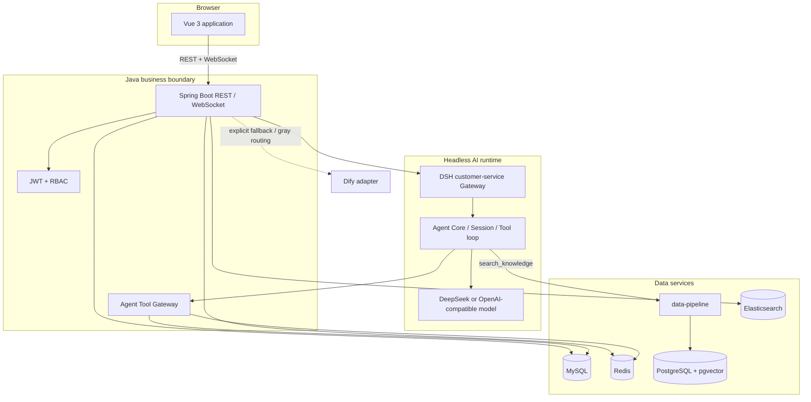
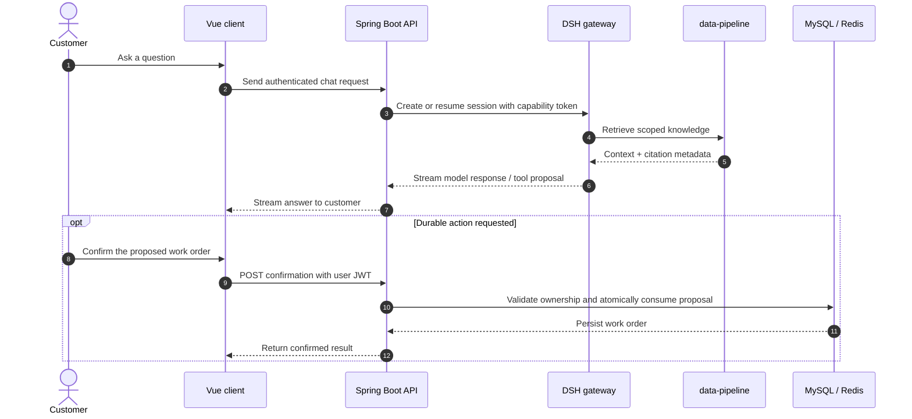

# AI Customer Service Platform

<p align="center">
  <strong>Bounded, auditable AI support for customer conversations, knowledge retrieval, and human-in-the-loop operations.</strong>
  <br />
  <a href="README-CN.md">简体中文</a>
</p>

<p align="center">
  
  
  
  
  
</p>

> The platform keeps business truth in Java services, gives agents only scoped context and tools, and requires an authenticated user confirmation before durable writes such as creating a work order.

## At a glance

| Surface | What it does | Primary runtime |
| --- | --- | --- |
| Customer chat | RAG answers, streaming responses, order lookup, and human handoff | Vue 3 + Spring Boot |
| Agent desk | Work-order queue, assignment, replies, SLA visibility, and realtime updates | Vue 3 + WebSocket/SSE |
| Knowledge center | Upload, parse, chunk, embed, review, publish, archive, and role-filter documents | data-pipeline + pgvector |
| AI orchestration | Session lifecycle, prompt budgets, tool calls, retries, and recovery boundaries | DeepSeek Harness |
| Governance | JWT authentication, RBAC, capability tokens, audit events, and metrics | Spring Security + Micrometer |

## Product surfaces

<table>
  <tr>
    <td width="33%"><strong>💬 Customer conversation</strong><br />Streaming AI replies with citations, context-aware order lookup, and a controlled path to a human agent.</td>
    <td width="33%"><strong>🧑‍💻 Agent workspace</strong><br />A focused operations view for queues, work orders, SLA state, realtime messages, and customer history.</td>
    <td width="33%"><strong>📚 Knowledge governance</strong><br />Versioned documents, extraction and chunking, review workflows, metadata filters, and role-aware retrieval.</td>
  </tr>
  <tr>
    <td><strong>🧾 Work-order proposals</strong><br />The model may prepare a short-lived proposal; only an authenticated user action can commit the final write.</td>
    <td><strong>🛡️ Permission boundaries</strong><br />Capability tokens bind tools to the real user and session. The model cannot select or impersonate an identity.</td>
    <td><strong>📈 Observable runtime</strong><br />Structured logs and metrics cover latency, first token, token usage, retrieval counts, tool results, and authorization failures.</td>
  </tr>
</table>

## Architecture

The diagrams are written in Mermaid so GitHub can render them as living, reviewable documentation.



### Conversation and write flow



## Design principles

- **Business truth stays server-side.** The Java backend owns users, orders, work orders, sessions, and authorization decisions.
- **Agents depend on protocols.** Agent Core consumes `KnowledgeRetriever`, `ChatModel`, and tool contracts instead of importing database or model-provider implementations.
- **Retrieval is filtered before it reaches the model.** `data-pipeline` applies metadata, expiry, parent-child document, and role ACL constraints.
- **Writes are two-phase.** `create_work_order` produces a short-lived Redis proposal; a logged-in user must confirm it before the durable write.
- **Identity is not model-controlled.** The Java layer creates a short-lived user/session capability token and passes it through `X-Agent-Capability-Token`; it is never placed in model context.
- **Provider choice is explicit.** `dsh` is the default provider, `dify` is an explicit fallback, and `gray` supports stable per-session routing.

## Repository map

```text
Backend/                  Spring Boot multi-module business backend
  backend-domain/         Domain models, repositories, and ports
  backend-application/    Use cases, sessions, and async workflows
  backend-infrastructure/ MySQL/Redis/RabbitMQ/ES/Dify/DSH adapters
  backend-interfaces/     REST, WebSocket, security, and tool gateway
  backend-boot/            Runtime configuration and application entrypoint
  sql/                     MySQL initialization and migrations
Frontend/                 Vue 3 + Vite client
data-pipeline/            Parsing, chunking, embeddings, and pgvector HTTP service
deepseek-harness/         DSH source workspace and customer-service composition
history/                  Archived material excluded from the active workflow
ENGINEERING_AUDIT.md      Engineering audit, hardening notes, and verification record
README.md                 English project guide
README-CN.md              Chinese project guide
```

## Requirements

| Component | Supported baseline |
| --- | --- |
| JDK | 21+ |
| Maven | 3.9+ |
| Node.js | 22+ for `data-pipeline`; 22.19+ or 24+ for DSH |
| Docker Compose | PostgreSQL, Redis, RabbitMQ, Elasticsearch, and LibreOffice |
| PostgreSQL | 16 with the pgvector extension |
| MySQL | 8.0+ |
| pnpm | 11.7.0 for the DSH workspace |

## Quick start

Start the services in this order so each boundary can discover the next one.

### 1. Start infrastructure

From the repository root:

```bash
docker compose -f Backend/docker-compose.yml up -d
```

This starts `vector-postgres`, Redis, RabbitMQ, Elasticsearch, and LibreOffice. The vector database uses `pgvector/pgvector:pg16` and initializes from [`data-pipeline/sql/migrations/V1__knowledge_chunks.sql`](data-pipeline/sql/migrations/V1__knowledge_chunks.sql).

### 2. Start the data pipeline

```bash
cd data-pipeline
npm install
# Copy .env.example to .env and provide VECTOR_DATABASE_URL,
# EMBEDDING_API_KEY, and PIPELINE_SERVICE_TOKEN.
npm run dev
```

The service listens on `http://localhost:3002`. Use `/health` and `/ready` for probes; other endpoints require `Authorization: Bearer <PIPELINE_SERVICE_TOKEN>`.

To import an existing vector export once:

```bash
npm run migrate:chroma -- C:/path/to/export.json customer-service
```

The migration reads the export and writes to pgvector without adding the legacy vector store to the runtime path.

### 3. Start the DSH customer-service composition

```bash
cd deepseek-harness
pnpm install
pnpm build:lib:host
```

Provide the following runtime variables:

```text
DEEPSEEK_API_KEY              Model provider credential
DSH_GATEWAY_SERVICE_TOKEN     Shared token expected by the Java backend
PIPELINE_SERVICE_TOKEN        Token used when DSH calls data-pipeline
BACKEND_BASE_URL              http://localhost:8081
DATA_PIPELINE_URL             http://localhost:3002
```

Then launch the explicit ACP composition:

```bash
node --import tsx packages/examples/acp-demo/src/bin.ts \
  --config examples/customer-service/cordis.yml
```

The gateway listens on `127.0.0.1:3001`. This customer-service example is a direct ACP composition, not an installed `dsh` profile.

### 4. Build and start the backend

Initialize MySQL with [`Backend/sql/init.sql`](Backend/sql/init.sql), then provide:

```text
JWT_SECRET                         At least 32 UTF-8 bytes; no insecure default
DB_URL / DB_USERNAME / DB_PASSWORD MySQL connection settings
DSH_GATEWAY_SERVICE_TOKEN          Must match the DSH gateway
DSH_GATEWAY_BASE_URL               Defaults to http://localhost:3001
AGENT_PROVIDER                     dsh (default), dify, or gray
```

Build and run:

```bash
cd Backend
mvn -o -pl backend-boot -am package
java -jar backend-boot/target/backend-boot-0.0.1-SNAPSHOT.jar
```

The backend listens on `http://localhost:8081`. Flyway applies the bundled migrations during startup.

### 5. Start the frontend

```bash
cd Frontend
npm install
npm run dev
```

Open `http://localhost:5173`. Vite proxies `/api` and `/ws` to the backend on port `8081`.

## Service map

| Service | Default address | Probe / purpose |
| --- | --- | --- |
| Frontend | `http://localhost:5173` | Vue development server |
| Backend | `http://localhost:8081` | REST, WebSocket, `/actuator/health` |
| DSH gateway | `http://localhost:3001` | Headless customer-service AI boundary |
| Data pipeline | `http://localhost:3002` | `/health`, `/ready`, secured RAG APIs |
| MySQL | `localhost:3306` | Business facts and authorization data |
| PostgreSQL | `localhost:5432` | pgvector knowledge chunks |
| Redis | `localhost:6379` | Cache, sessions, proposals, and locks |
| RabbitMQ | `localhost:5672` | Domain events and async workflows |
| Elasticsearch | `http://localhost:9200` | Operational and knowledge search support |

## Security boundaries

The agent-facing tools are intentionally narrow:

| Tool capability | Behavior |
| --- | --- |
| `order:read:self` | Read orders belonging to the current user only |
| `knowledge:read` | Search server-filtered knowledge through data-pipeline |
| `work_order:propose:self` | Create a short-lived Redis proposal; never commits a work order |

The confirmation endpoint is `POST /api/agent/tools/work-orders/proposals/{proposalId}/confirm`. Java re-checks the proposal owner and uses an atomic `getAndDelete` so a proposal cannot be consumed twice.

## Health checks and verification

Quick probes:

```bash
curl http://localhost:3002/health
curl http://localhost:3002/ready
curl http://localhost:8081/actuator/health
```

Recommended local checks:

```bash
# data-pipeline
cd data-pipeline
npm run typecheck
npm test -- --run
npm run build

# DSH host aggregate
cd deepseek-harness
pnpm typecheck
pnpm build:lib:host

# Java modules
cd Backend
mvn -o -pl backend-interfaces -am test

# Vue unit test
cd Frontend
npm run test:unit
```

## Documentation

- [Chinese guide](README-CN.md)
- [Engineering audit and verification record](ENGINEERING_AUDIT.md)
- [Backend database initialization](Backend/sql/init.sql)
- [Customer-service DSH configuration](deepseek-harness/examples/customer-service/cordis.yml)
- [Customer-service composition notes](deepseek-harness/examples/customer-service/README.md)
- [Vector schema migration](data-pipeline/sql/migrations/V1__knowledge_chunks.sql)

## Contributing

1. Keep credentials and local `.env` files out of commits.
2. Preserve the Java business boundary when adding new agent tools.
3. Add or update tests at the narrowest correct seam.
4. Run the relevant verification commands before opening a pull request.

For the detailed completion score, P0–P3 findings, file-level changes, prompt comparisons, test history, and remaining technical debt, see [`ENGINEERING_AUDIT.md`](ENGINEERING_AUDIT.md).
